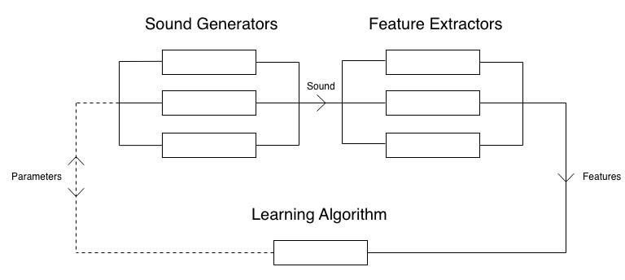

# Analysis of computer music using machine learning models
## Final year dissertation project

This project created a framework for analysing the possible sounds that a software synthesizer can make.
It then analysed two simple synthesizers using the framework created.

The framework itself is composed of three main components: sound generators, feature extractors, and learning algorithms.

For a detailed explanation of the diagram above, including design and implementation of it, refer to the *Dissertation Full.pdf* document.

### Repository Structure
`Code`: all the code written in this project, including some extra libraries used (such as the ctcsound library).

`Sounds`: sounds referred to in the dissertation document.

`Dissertation Full`: the full dissertation, available to read.

### Dependencies
* Csound 6.14
* Python 3.7.5
* Essentia_streaming_extractor_music for the correct CPU architecture (two are provided)
* scikit-learn 0.22.2
* pandas
* plotly
* matplotlib
